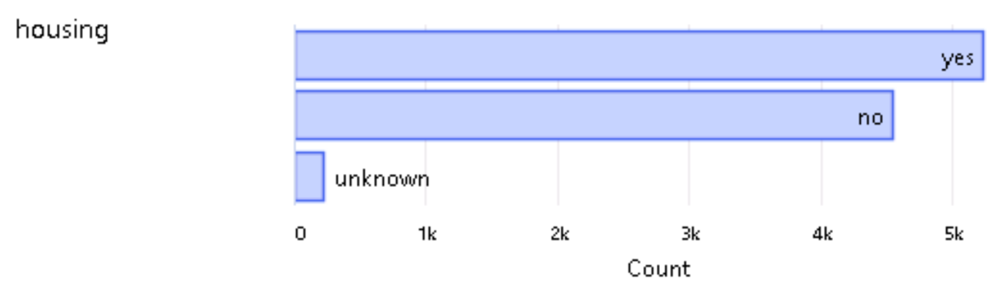
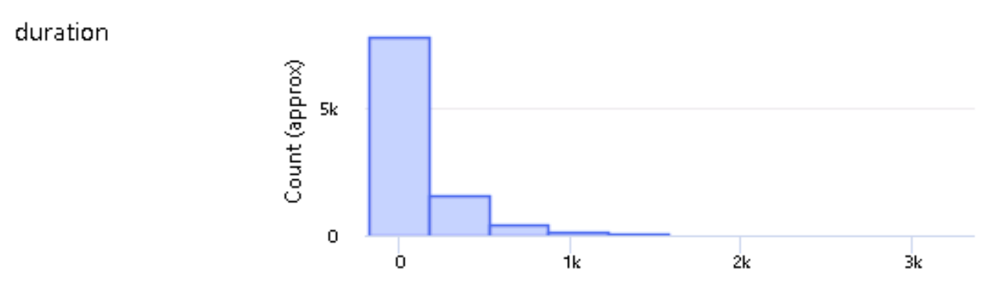

# Operationalizing Machine Learning

This project consists of two parts: 
1. The first part consists of creating a production machine learning model using AutoML in Azure Machine Learning Studio, and then deploying the best model and consuming 
it using the Swagger UI using the REST API endpoint and the key created for the deployed model. 
2. The second part of the project follows the same steps, but this time Azure Python SDK is used to create, train, and publish a pipeline with Jupyter Notebook. 
The whole procedure is explained in this README file and the result is demonstrated in the screencast video. 

For both parts of the project, I use the dataset available here, which contains marketing data about people. 
The data refer to direct marketing campaigns by a Portuguese banking institution. 
The classification objective is to predict whether the customer will subscribe to a bank term deposit. 
The result of the prediction appears in column **_y_** and it's either **_yes_** or **_no_**.

## Architectural Diagram
The figure below shows steps that will be implemented in this project:

## Key Steps

### 1. Authentication

- This is the important step to ensure secure and authentic access. Authentication is required to create the service principal account and associate it with a specific workspace.
- I am using the provided lab Udacity to complete this project. 
So I skipped this step because I don't have permission to create a security principal.

### 2. Automated ML Experiment

- We create the new Automated ML Run Experiment and then upload the [bank marketing dataset](https://automlsamplenotebookdata.blob.core.windows.net/automl-sample-notebook-data/bankmarketing_train.csv).  
- We run the experiment by configuring a new compute cluster, using classification and making sure best model explanation is enabled.

#### Registered Dataset

#### AutoML Experiment Completed

#### Best Model

### 3. Deploy the Best Model

- After completing the AutoML run, we get our best model.  
- Then we will deploy this model using **Azure Container Instance** (**ACI**) and enable **Authentication** to prevent unauthorized access.

### 4. Enable Logging

- After deployment, we enable the Application Insights from the deployed model.  
- This helps us create log output using the Python SDK.  
- It plays a crucial role in debugging problems in production environments.

#### Logs from logs.py script

#### Application Insights Enabled

### 5. Swagger Documentation

- Swagger helps us build, document, and consume RESTful web services.  
- It also explains what kind of requests the API can handle like **POST** and **GET**.

#### Default Swagger page

#### Swagger Model Documentation

### 6. Consume Model Endpoints

- We need to use the provided service to get the data using an **HTTP request**.  
- It helps us validate data by determining if something has a problem or is wrong.

#### Endpoint.py output (Consuming Model Endpoints)

#### Benchmark output

### 7. Create and Publish a Pipeline

- The last and the most vital step is to make the model publically available.  
- This is done by **creating** a pipeline and then **publishing** it.  
- It is synonymous to Automation as the pipeline create ways for other services to interact with it using **HTTP endpoint**.

#### Created Pipeline and Pipeline Overview 

#### Pipeline Endpoint

#### Bankmarketing Dataset with AutoML

#### Published Pipeline Overview

#### Status Active

#### Running Pipeline

#### Run Widget - RunDetails Widget (Bild)

## Screen Recording
*TODO* Provide a link to a screen recording of the project in action. Remember that the screencast should demonstrate:

## Standout Suggestions
*TODO (Optional):* This is where you can provide information about any standout suggestions that you have attempted.
